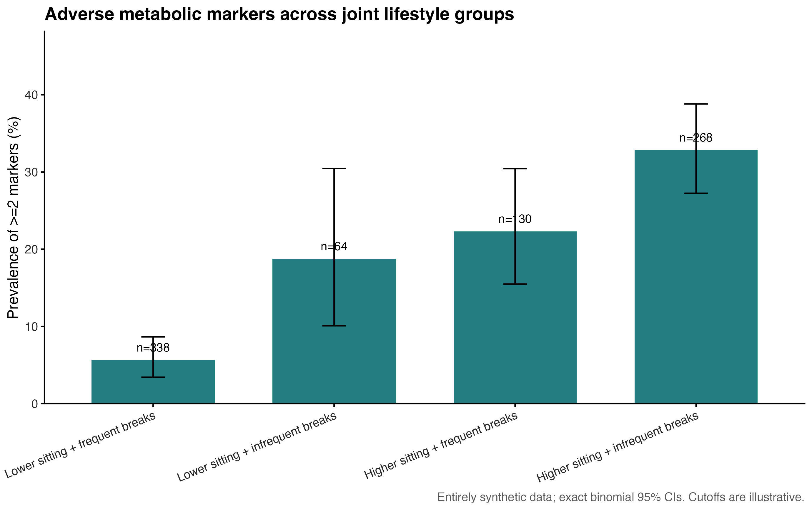
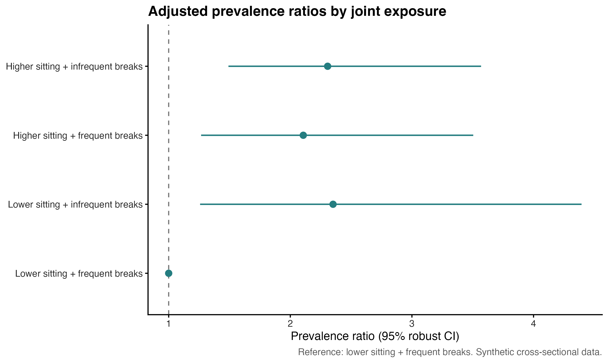
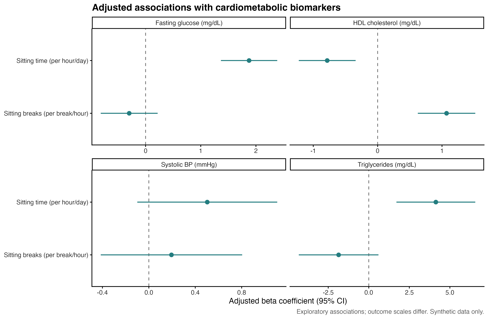
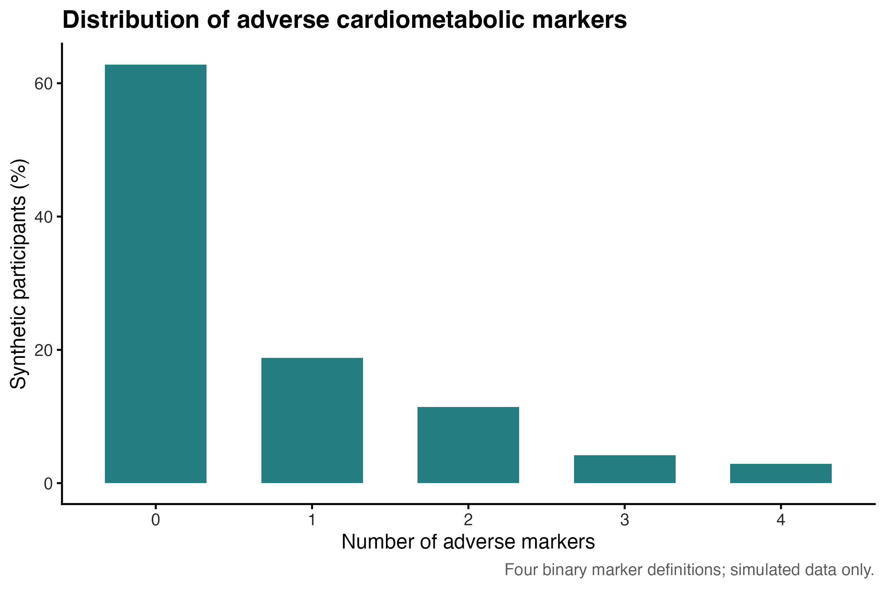

# Preventive Medicine Analysis Demo

Reproducible analysis of synthetic preventive-health data using R.

This project demonstrates a cross-sectional analysis workflow focusing on sedentary behavior and cardiometabolic risk markers, including joint-exposure analysis, multivariable regression, and sensitivity analyses.

## Methods

- Synthetic dataset of 800 adults with lifestyle and cardiometabolic variables
- Descriptive statistics, risk-marker prevalence, and missingness assessment
- Modified Poisson regression with robust standard errors
- Progressive covariate adjustment
- Joint-exposure and interaction analysis
- Model-based standardized prevalence estimates
- Multivariable linear regression for cardiometabolic biomarkers
- Benjamini-Hochberg false-discovery-rate adjustment
- Subgroup and sensitivity analyses
- Publication-style tables and figures

## Repository Structure

- `data/` — synthetic dataset and variable dictionary
- `scripts/` — numbered R scripts for data generation and statistical analysis
- `output/` — generated tables, figures, and model diagnostics
- `run_all.R` — runs the complete workflow
- `ANALYSIS_PLAN.md` — outcome definitions, analysis decisions, and limitations

## Quick Start

Install the required packages once:

```r
install.packages(c("MASS", "dplyr", "readr", "tibble", "sandwich", "ggplot2"))
```

Run the complete workflow from the project root:

```r
source("run_all.R")
```

This regenerates the synthetic dataset and all analysis outputs.

## Workflow

1. Generate a synthetic preventive-health dataset and data dictionary.
2. Summarize baseline characteristics, risk markers, and missingness.
3. Fit modified Poisson models with progressively adjusted covariates.
4. Compare joint categories of sitting time and sitting-break frequency.
5. Estimate associations with continuous cardiometabolic biomarkers and apply FDR correction.
6. Conduct alternative-outcome and nonsmoker sensitivity analyses.
7. Generate tables, figures, model diagnostics, and session information.

## Example Outputs

### Joint-Exposure Prevalence



### Adjusted Prevalence Ratios



### Cardiometabolic Biomarker Associations



### Risk-Marker Distribution



## Reproducibility

The complete analysis can be reproduced using `source("run_all.R")`. R session information is saved to `output/session_info.txt`.

The [GitHub Actions workflow](.github/workflows/r-check.yml) runs the analysis and checks key generated outputs. Model specifications and diagnostic considerations are documented in [ANALYSIS_PLAN.md](ANALYSIS_PLAN.md).

## Data Privacy

All data are synthetic. No real participant, patient, hospital, or unpublished research-project data are included. The constructed risk-marker outcome is for demonstration and is not a clinical diagnosis.
